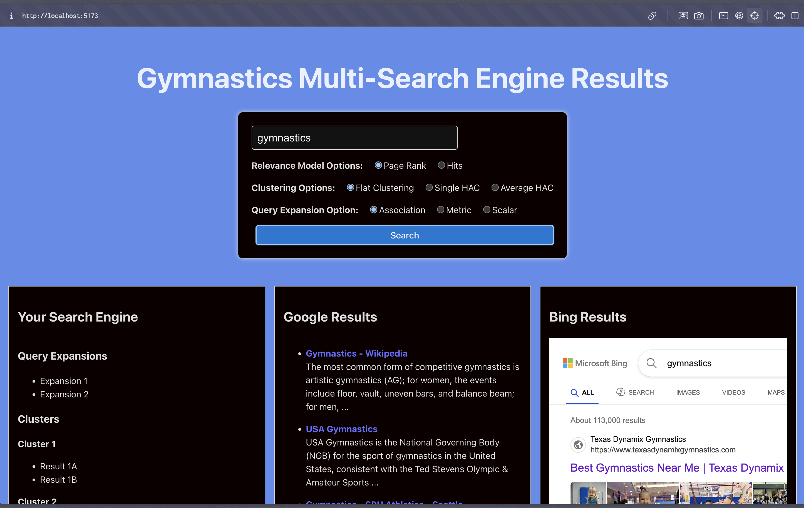

---

# Gymnastics Search Engine Multi-Search UI

A React-based web application that allows users to search the **Gymnastics Search Engine** (with advanced ranking, clustering, and query expansion options) and compare results side-by-side with Google and Bing.

---

## Features

-  **Central Search Panel**
- Enter your query
- Select relevance model: Page Rank or Hits
- Select clustering: Flat, Single HAC, Average HAC
- Select query expansion: Association, Metric, Scalar
- Submit to search all engines at once

-  **Three Results Panels**
- **Gymnastics Search Engine**: Advanced, customizable results from your own Flask+Solr backend
- **Google Results**: Displayed via Google Programmable Search Engine widget or Google Custom Search API
- **Bing Results**: Displayed via Bing Search API or direct links

-  **Responsive Design**: Panels resize and stack for all screen sizes

---

## Screenshots

 <!-- Replace with your actual screenshot file -->

---

## Getting Started

### 1. Clone the repository

```bash
git clone https://github.com/karlos37/final_ir_web.git
cd final_ir_web
```

### 2. Install dependencies

```bash
npm install
```

### 3. Configure API Keys (if using Google/Bing APIs)

-  Add your API keys and CSE ID in the relevant component files (`GoogleResults.jsx`, etc.)
-  Or use a `.env` file if you prefer

### 4. Start the React app

```bash
npm start
```

### 5. Backend Setup

-  Ensure your Flask backend for the **Gymnastics Search Engine** is running and accessible to the frontend.
-  The backend should accept the query and options as GET parameters and return JSON.

---

## Project Structure

```plaintext
src/
  components/
    SearchPanel.jsx
    SearchResults.jsx
    GoogleResults.jsx
    BingResults.jsx
    GoogleSearchEngineWidget.jsx
    styles.css
  App.jsx
  index.js
```

---

## How It Works

1. **User enters a gymnastics-related query and selects search options**
2. **On submit**, the query and selected options are sent to the Flask backend
3. **Backend**:
    - Processes the query and options
    - Fetches results from Solr
    - Applies ranking, clustering, and query expansion as selected
    - Returns JSON results
4. **Frontend displays**:
    - Gymnastics Search Engine results (with clusters and expansions)
    - Google results (via widget or API)
    - Bing results

---

## Customization

-  Update ranking, clustering, and expansion options in `SearchPanel.jsx`
-  Change backend endpoint in `SearchResults.jsx`
-  Switch between Google widget and API in `GoogleResults.jsx`

---

## Credits

-  [React](https://reactjs.org/)
-  [Google Programmable Search Engine](https://programmablesearchengine.google.com/)
-  [Bing Search API](https://www.microsoft.com/en-us/bing/apis/bing-search-api-v7)
-  [Flask](https://flask.palletsprojects.com/)
-  [Apache Solr](https://solr.apache.org/)

---

**Questions or suggestions?**  
Open an issue or submit a pull request!

---